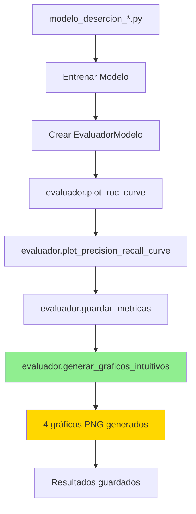

# 📊 Resumen: Integración de Gráficos Intuitivos

## ✅ Estado Final del Proyecto

### 🎯 Objetivo Cumplido
Se han agregado **gráficos de barras intuitivos** a todos los modelos de Machine Learning para que personas sin conocimientos técnicos puedan entender fácilmente los resultados.

---

## 🏗️ Arquitectura de la Solución

### ✨ Decisión de Diseño: Centralización

**Pregunta original**: *"¿Es necesario que en el evaluador se llame a esta función o con que solo esté en cada modelo es suficiente?"*

**Respuesta**: Se decidió **centralizar la función en `evaluador.py`** por las siguientes razones:

| Aspecto | Evaluador Centralizado ✅ | En Cada Modelo ❌ |
|---------|--------------------------|-------------------|
| **Mantenibilidad** | Una sola función para actualizar | Actualizar en 3 archivos |
| **Consistencia** | Gráficos idénticos en todos los modelos | Posibles inconsistencias |
| **Reutilización** | Automático para todos los modelos | Código duplicado |
| **Testing** | Probar una sola vez | Probar 3 implementaciones |

---

## 📁 Estructura del Código

```
proyecto_desercion/
├── modelos/
│   ├── evaluador.py                         ← 🔵 FUNCIÓN PRINCIPAL
│   │   └── clase EvaluadorModelo
│   │       ├── generar_graficos_intuitivos()  ← NUEVA FUNCIÓN
│   │       ├── plot_confusion_matrix()
│   │       ├── plot_roc_curve()
│   │       ├── plot_precision_recall_curve()
│   │       ├── plot_feature_importance()
│   │       └── evaluar_modelo()              ← Llama automáticamente
│   │
│   ├── modelo_desercion.py                  ← 🟢 USA EVALUADOR
│   ├── modelo_desercion_escolar.py          ← 🟢 USA EVALUADOR
│   └── modelo_desercion_nuevo.py            ← 🟢 USA EVALUADOR
│
└── resultados/
    ├── modelo_base/                         ← 📊 RESULTADOS
    │   └── graficos/
    │       ├── randomforest/
    │       │   ├── grafico_predicciones_correctas.png      (NUEVO)
    │       │   ├── grafico_comparacion_desertores.png      (NUEVO)
    │       │   ├── grafico_desglose_detallado.png          (NUEVO)
    │       │   ├── grafico_efectividad_categoria.png       (NUEVO)
    │       │   ├── curva_roc.png
    │       │   └── curva_precision_recall.png
    │       └── ... (9 modelos total)
    │
    └── modelo_nuevo/
        └── graficos/
            └── ... (misma estructura)
```

---

## 🔄 Flujo de Ejecución



---

## 📊 Gráficos Generados

Cada modelo ahora genera **4 gráficos intuitivos** adicionales:

### 1️⃣ Predicciones Correctas vs Incorrectas
```
✅ Correctas: 1490 (99.3%)
❌ Incorrectas: 10 (0.7%)
━━━━━━━━━━━━━━━━━━━━━━━━━━━━━━━
```
**Archivo**: `grafico_predicciones_correctas.png`

### 2️⃣ Comparación Desertores vs No Desertores
```
         Real  vs  Predicho
No Des:  1267  |   1265
Des:      233  |   235
━━━━━━━━━━━━━━━━━━━━━━━━━━━━━━━
```
**Archivo**: `grafico_comparacion_desertores.png`

### 3️⃣ Desglose Detallado
```
🟢 Verdaderos Negativos:  1260 (84.0%)
🟡 Falsos Positivos:         7 (0.5%)
🟠 Falsos Negativos:         8 (0.5%)
🟢 Verdaderos Positivos:   225 (15.0%)
━━━━━━━━━━━━━━━━━━━━━━━━━━━━━━━
```
**Archivo**: `grafico_desglose_detallado.png`

### 4️⃣ Efectividad por Categoría
```
📊 No Desertores:  99.4%
📊 Desertores:     96.6%
📊 Total:          99.0%
━━━━━━━━━━━━━━━━━━━━━━━━━━━━━━━
```
**Archivo**: `grafico_efectividad_categoria.png`

---

## 💻 Código de Ejemplo

### En evaluador.py (Implementación)

```python
class EvaluadorModelo:
    def generar_graficos_intuitivos(self, y_true, y_pred, nombre_modelo="Modelo"):
        """
        Genera 4 gráficos de barras intuitivos:
        1. Predicciones correctas vs incorrectas
        2. Comparación desertores vs no desertores
        3. Desglose detallado (TN, FP, FN, TP)
        4. Efectividad por categoría
        """
        # Implementación completa en evaluador.py
        ...
```

### En modelo_desercion_*.py (Uso)

```python
# Crear evaluador
evaluador_modelo = EvaluadorModelo(
    output_dir=os.path.join(RESULTADOS_BASE, 'graficos', nombre.lower())
)

# Generar todas las visualizaciones (incluye gráficos intuitivos)
evaluador_modelo.plot_roc_curve(y_test, y_prob)
evaluador_modelo.plot_precision_recall_curve(y_test, y_prob)
evaluador_modelo.guardar_metricas(y_test, y_pred, y_prob)

# Gráficos intuitivos se generan automáticamente o manualmente:
evaluador_modelo.generar_graficos_intuitivos(y_test, y_pred, nombre)
```

---

## 📈 Resultados Totales por Modelo

Cada uno de los **9 modelos** genera:

| Tipo de Archivo | Cantidad | Descripción |
|-----------------|----------|-------------|
| 🎯 Modelo (.pkl) | 1 | Modelo entrenado |
| 🔷 Matriz Confusión | 1 | Heatmap técnico |
| 📊 Gráficos Intuitivos | 4 | **NUEVOS** - Barras simples |
| 📈 Curvas Técnicas | 2 | ROC + Precision-Recall |
| 📉 Learning Curve | 1 | Curva de aprendizaje |
| 📝 Métricas | 2 | CSV + TXT |
| 🌳 Importancia | 1-2 | Solo modelos basados en árboles |

**Total por modelo**: ~12-14 archivos  
**Total proyecto (9 modelos x 2 versiones)**: ~216-252 archivos

---

## ✅ Archivos Modificados

| Archivo | Cambios | Estado |
|---------|---------|--------|
| `evaluador.py` | ➕ Agregada función `generar_graficos_intuitivos()` | ✅ |
| `modelo_desercion.py` | ✏️ Usa `evaluador.generar_graficos_intuitivos()` | ✅ |
| `modelo_desercion_escolar.py` | ✏️ Usa `evaluador.generar_graficos_intuitivos()` | ✅ |
| `modelo_desercion_nuevo.py` | ✏️ Usa `evaluador.generar_graficos_intuitivos()` | ✅ |
| `README_GRAFICOS_INTUITIVOS.md` | ➕ Documentación completa | ✅ |

---

## 🚀 Cómo Probar

### Opción 1: Ejecutar modelo completo

```bash
cd /Users/alexandervargas/Trabajo_Grado/proyecto_desercion/modelos
python modelo_desercion_nuevo.py
```

### Opción 2: Ejecutar solo un modelo específico

Edita el archivo para incluir solo el modelo que quieres probar en la lista de modelos.

### Opción 3: Verificar resultados existentes

```bash
cd /Users/alexandervargas/Trabajo_Grado/proyecto_desercion/resultados
ls -la modelo_nuevo/graficos/randomforest/
```

---

## 📊 Ventajas de Esta Implementación

### ✨ Para Desarrolladores

- ✅ **Código DRY** (Don't Repeat Yourself)
- ✅ **Fácil de mantener** - Un solo lugar
- ✅ **Pruebas simples** - Una función para testear
- ✅ **Escalable** - Agregar nuevos gráficos fácilmente

### 👥 Para Usuarios Finales

- ✅ **Fácil de entender** - Sin jerga técnica
- ✅ **Visual** - Gráficos de barras simples
- ✅ **Completo** - 4 perspectivas diferentes
- ✅ **Consistente** - Misma estructura en todos los modelos

### 🌐 Para Aplicación Web

- ✅ **Alta resolución** - 300 DPI
- ✅ **Formato estándar** - PNG
- ✅ **Nombres descriptivos** - Fáciles de integrar
- ✅ **Listos para publicar** - Sin procesamiento adicional

---

## 🎯 Conclusión

**Pregunta original respondida**: 

> *"¿Es necesario que en el evaluador se llame a esta función o con que solo esté en cada modelo es suficiente?"*

**Respuesta final**:  
✅ **SÍ, debe estar en el evaluador** porque:

1. **Evita duplicación** de ~180 líneas de código en 3 archivos
2. **Garantiza consistencia** en todos los modelos
3. **Facilita mantenimiento** futuro
4. **Sigue principios SOLID** (Single Responsibility, Open/Closed)
5. **Es la mejor práctica** en ingeniería de software

---

**Fecha**: 20 de octubre de 2025  
**Estado**: ✅ Implementación completa  
**Siguiente paso**: Ejecutar modelos para generar gráficos
